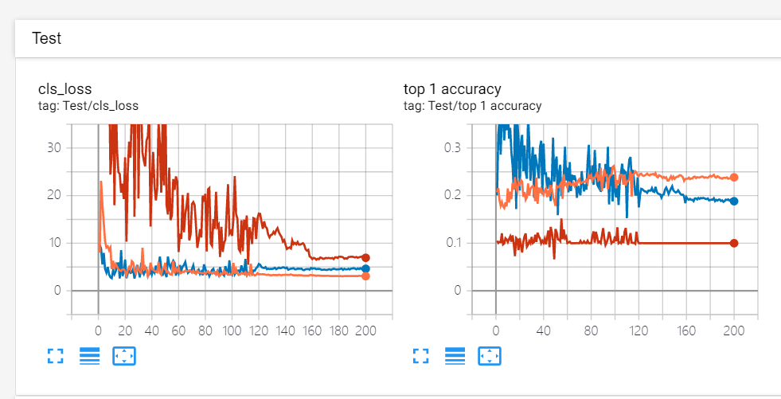
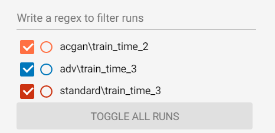

# Dataset-Generation

This repository provides simple PyTorch implementations for generating representation based on adversarial training and  generative adversarial networks  on CIFAR-10.

## 1. Dataset Generation Base on Adversarial Training

***step 1: Training a robust Model*** 

```python
--attack-steps ATTACK_STEPS
                   number of steps for adversarial attack (default: 7)
--constraint {inf,2,unconstrained}
                      adv constraint (choices: {arg_type}, default:
                    required)
--eps EPS             adversarial perturbation budget (default: required)
--attack-lr ATTACK_LR
                      step size for PGD (default: required)
--use-best {0,1}      if 1 (0) use best (final) PGD step as example
                      (choices: {arg_type}, default: 1)
--random-restarts RANDOM_RESTARTS
                      number of random PGD restarts for eval (default: 0)
--custom-eps-multiplier EPS_SCHEDULE
                      epsilon multiplier sched (same format as LR schedule)
```

*example:Training a robust ResNet-50 for the Cifar10 dataset*

```python
CUDA_VISIBLE_DEVICES=1,2,3,4 python  main_adv.py --dataset cifar --data $Cifar10_PATH --adv-train 1 --arch resnet50 \
   --out-dir ./output/adv/ --eps 0.5 --attack-lr 0.1 --attack-steps 7 --constraint 2 --exp-name train_time:1
```

***step 2: Evaluating trained models***

To evaluate a trained model, we use the `--eval-only` flag when calling `main_adv.py`. To evaluate the model for just standard (not adversarial) accuracy, only the following arguments are required:

```python
python -m main_adv.py --dataset DATASET --data /path/to/dataset \
   --eval-only 1 --out-dir OUT_DIR --arch arch --adv-eval 0 \
   --resume PATH_TO_TRAINED_MODEL_CHECKPOINT
```

*example：Testing the standard and adversarial accuracy of a trained CIFAR-10 model with L2 norm constraint of 0.5 and 100 L2-PGD steps:*

```python
python -m main_adv.py --dataset cifar --eval-only 1 --out-dir ./output/adv/eval_time:1/ --arch resnet50 --adv-eval 1 --constraint 2 --eps 0.5 --attack-lr 0.1 --attack-steps 100 --resume PATH_TO_TRAINED_MODEL_CHECKPOINT
```

***step 3: Generate new dataset base on trained model***

```
python gen_cifar10_adv.py --out-dir=./output/adv/ --cuda --dataroot=$Cifar10_PATH --resume-path PATH_TO_TRAINED_MODEL_CHECKPOINT --ngpu 4 --gen-time 1
```


## 2. Dataset Generation Base on Standard Training

***step 1: Training a non-robust Model***

set `--adv-train` option 0

*example：Training a non-robust ResNet-18 for the CIFAR dataset*

```python
 python main_adv.py --dataset cifar --data  $Cifar10_PATH --adv-train 0 --arch resnet50 --out-dir ./output/standard/  --exp-name train_time:1
```

***step 2: Evaluating trained models***

similar to above

***step 2: Generate new dataset base on trained model***

```
python gen_cifar10_adv.py --out-dir=./output/standard/ --cuda --dataroot=$Cifar10_PATH --resume-path PATH_TO_TRAINED_MODEL_CHECKPOINT --ngpu 4 --gen-time 1
```


## 3. Dataset Generation Base on ACGAN

***step1: Train ACGAN***

(bug: 数据集大小应该是batchsize的倍数)

```python
python main_acgan.py --out-dir=./output/acgan/ --niter=200 --batchsize=100 --cuda --dataset=cifar10 --imageSize=32 --dataroot=$Cifar10_PATH --gpu=0,1,2,3 --train_time 1 
```

***step2: Generate dataset***

```python
python gen_cifar10_acgan.py --out-dir=./output/acgan/ --cuda --dataset=cifar10 --ngpu 4 --gen-time 1
```

## 4. Temp Result

| new datase            | test【resnet18】mixup |
| --------------------- | --------------------- |
| adv 【resnet50】      | train_time:3<br />    |
| standard 【resnet50】 | train_time:3<br />    |
| acgan                 | train_time:2<br />    |







## Reference

[robustness package](https://robustness.readthedocs.io/en/latest/index.html)

[clvrai](https://github.com/clvrai)/**[ACGAN-PyTorch](https://github.com/clvrai/ACGAN-PyTorch)**

[MadryLab](https://github.com/MadryLab)/**[robust_representations](https://github.com/MadryLab/robust_representations)**